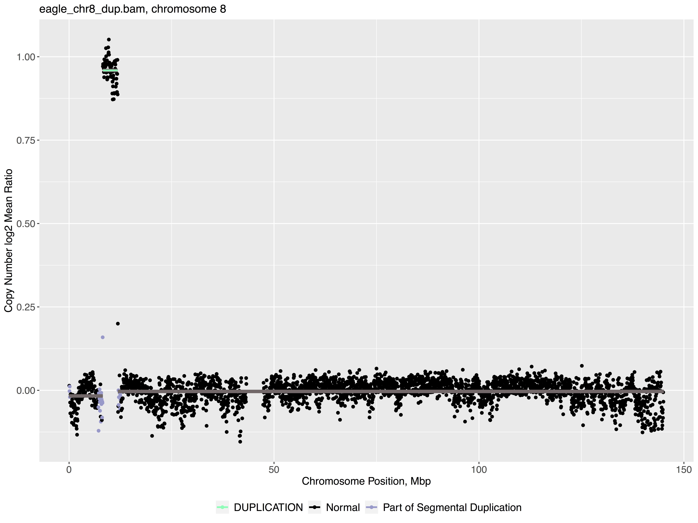
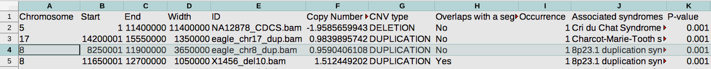

# ConanVarvar

## Overview
This program is a versatile tool for detecting copy number variations (CNVs) from BAM files. The tool was designed specifically for the detection of *large* (>1 Mb) CNVs in batches of multiple samples.

## Features
* Efficient joint calling of CNVs with in-built parallelisation and read counts storing.
* Up to several times less false positives compared to other CNV callers.
* Robust GC and mappability correction and additional filtering of false positives based on variants' p-values, their occurrence, overlaps with segmental duplications and associated syndromes.
* Choose between the *Shiny* graphical user interface (GUI) or the familiar command-line interface (CLI).
* Optional on-the-fly sorting and indexing of input BAM files.
* Optional visualisation.
* No FASTA reference files required.

## How to use

### Installation
`docker pull mgud/conanvarvar:latest`

### Input files
The program can accept both full BAM files (i.e. containing some coverage in all chromosomes) and single-chromosome BAMs.
To extract a chromosome of interest (e.g. chromosome 7) from a full BAM file using Samtools, run
`samtools view -bh file.bam chr7 > chr7.bam && samtools index chr7.bam`

### Usage scenarios

Assuming your BAM files are stored in `/Users/user/BAM_files` on the host machine, you can run `docker run -it --rm -v /Users/user/BAM_files:/data -e GUI=true -p 80:3838 mgud/conanvarvar` to launch the GUI of ConanVarvar. To open the GUI in a web browser, go to <http://127.0.0.1>. Inside the GUI, the new path to your BAM files is now simply `/data`.

Alternatively, the command-line interface can be utilised: `docker run -it --rm -v /Users/user/Desktop/data:/data mgud/conanvarvar --bamdir=/data --outdir=/data/output`. To see all available options, run `docker run mgud/conanvarvar --help`.

Please note that by default Docker uses only half of CPUs available on the host machine. Also, you can mount multiple folders (e.g. one folder for input files and one for the output) by using multiple `-v` arguments in `docker run`.

## Results
The program outputs a spreadsheet with potential CNVs together with optional per-chromosome plots (see the example below). Should any of the analysed samples have any large CNVs, they will show up as relatively large red (deletions) or green (duplications) horizontal bars that are significantly different to the normal zero line (grey).

Entries in the spreadsheet are presorted in the decreasing order of their significance. That is, the user is advised to carefully look through the first few potential CNVs from the spreadsheet, especially the ones associated with some known CNV syndromes (from the [DECIPHER](https://decipher.sanger.ac.uk/disorders#syndromes/overview "DECIPHER CNV Syndrome List") and [OMIM](https://omim.org "OMIM homepage") databases), and cross-check with the plots.

## Performance

| CPUs | RAM | Input BAM files | Parameters | Pre-counts | Plots | Time |
| :------------- | :------------- | :------------- | :------------- | :-------------- | :-------------- | :-------------: |
| 4 | 128 GB | 1, full (64 GB), sorted and indexed | Default | No | No | **20-25 mins** |
| 4 | 128 GB | 1, one chromosome, sorted and indexed | Default | No | No | **1-2 mins** |

## Detailed pipeline

1. Break the chromosomes down into consecutive bins (or windows) of fixed size with GC content and mappability metadata using `CopywriteR`. **Warning:** Please note that the remaining region at the end of the chromosome is not included in further processing. For example, if the user sets bin size to 100kb, then for chromosome 22, which has the length of 50818468bp, a total of 508 bins will be created and the remaining 18468bp region will be ignored.

2. Detect the directory containing input BAM files, sort and index the files if necessary using `Rsamtools` (sorted and indexed BAM files will be created in the same directory as the original ones, so make sure you have the permissions to write in that directory). The process is done in parallel, with one BAM file being processed on one CPU. This can take a significant amount of time if the input directory contains many BAM files, so by default this step is skipped.

3. Count reads in each of the BAM files using `exomeCopy`. Only the reads having the mapping quality above the preset threshold will be considered for counting. This is done in parallel, with one BAM file being processed on one CPU.

4. Perform GC and mappability correction and convert the read counts to copy number values, separately for each of the chromosomes. Please see the description of the `correctReadcount` function from the `HMMcopy` package for the detailed summary of the correction process.

5. Perform segmentation on the copy number values using `fastseg`.

6. Analyse the obtained segments; separate normal segments from potential CNVs using thresholds and clustering; calculate p-values using bootstrap; calculate other statistics for each potential CNV.

7. Plot the results (optional) and generate a spreadsheet summarising the information about the identified CNVs.

## Test files
A BAM file with a simulated 10q22.3-23.2 deletion is available to test the program on.

* For users who wish to copy the file to their own AWS S3 bucket
    * `aws s3 cp s3://conanvarvar/NA12878_del10.bam s3://<bucket name>/<destination folder>`
    * `aws s3 cp s3://conanvarvar/NA12878_del10.bam.bai s3://<bucket name>/<destination folder>`
* For internet downloads (e.g. via wget):
    * <https://conanvarvar.s3-us-west-2.amazonaws.com/NA12878_del10.bam>
    * <https://conanvarvar.s3-us-west-2.amazonaws.com/NA12878_del10.bam.bai>

## License

This program is free software: you can redistribute it and/or modify it under the terms of the GNU General Public License as published by the Free Software Foundation, either version 3 of the License, or (at your option) any later version.

This program is provided without warranty of any kind.

See the GNU General Public License for more details <http://www.gnu.org/licenses/>.

Copyright (C) 2020 Victor Chang Cardiac Research Institute
